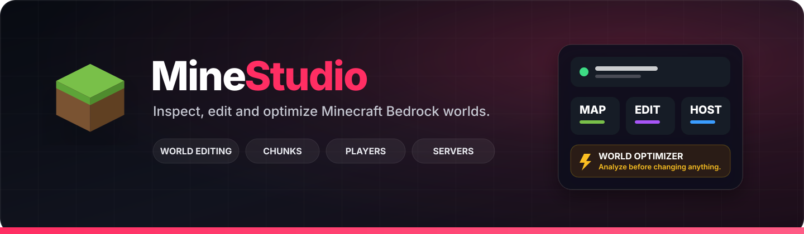
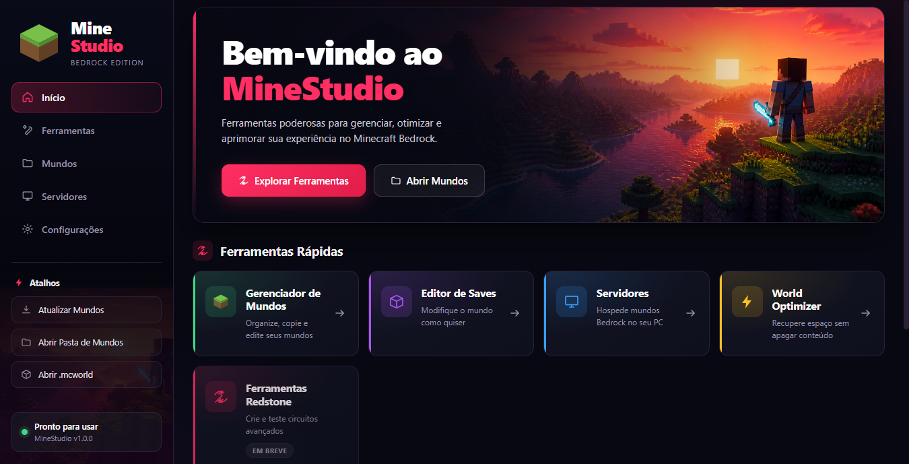
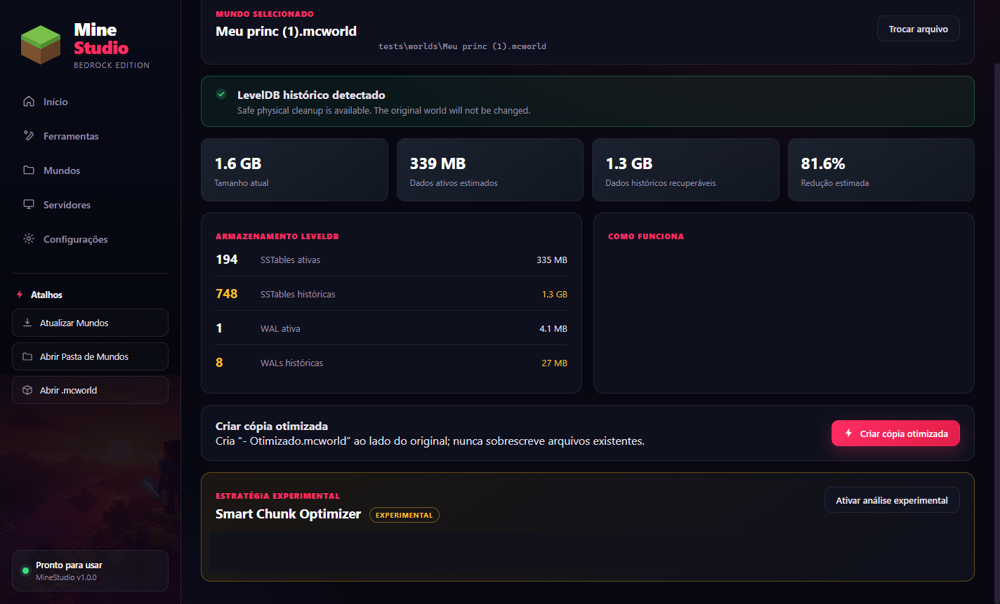

  
  
  
  
  
  

# MineStudio

**A visual desktop toolkit for inspecting, editing and optimizing Minecraft Bedrock worlds — now also capable of creating Bedrock add-ons.**

MineStudio brings world management, save editing, chunk exploration, player and inventory tools, storage optimization, local server controls and a new **Add-on Studio** into one Windows desktop application. It works with Bedrock world folders and exported `.mcworld` files, including worlds exported from consoles.

> **Public showcase:** this repository documents the current application and its verified capabilities. Source code, binaries, internal algorithms, detailed storage formats and private test artifacts are intentionally not published here.

## Highlights

| Area | Current capability |
|---|---|
| World management | Discover installed worlds, open folders and `.mcworld` archives |
| World editing | Game mode, difficulty, spawn, cheats and other world settings |
| Chunk tools | Interactive terrain map, layers, inspection and controlled chunk deletion |
| Players | Position, health, hunger, XP, game mode and status effects |
| Inventory | Main inventory, ender chest, equipment, item editing and enchantments |
| Entities | Browse stored entities, inspect counts and perform bulk cleanup |
| Optimization | Analyze storage and create a separate optimized world copy |
| Add-on Studio | **Beta:** visually build Bedrock add-ons, manage versions, export `.mcaddon` packages and install them into Minecraft |
| Servers | Create, configure and operate local Bedrock server instances |
| Safety | Validation, automatic snapshots, backups and explicit confirmations |

## Explore and edit worlds visually

The **Chunk Explorer** renders the chunks that actually exist in the save as an interactive top-down map. It can show terrain and height, chunk boundaries, players, world spawn and categorized entity markers while supporting pan, zoom, dimension switching and block-level hover inspection.

The map is also an editing surface: individual chunks can be removed after confirmation so Minecraft can regenerate them later. MineStudio creates a backup before destructive chunk operations.

MineStudio also exposes common world settings through a dedicated editor instead of requiring manual save-file work. Current editing includes world name, game mode, difficulty, cheats, spawn coordinates and pack-related settings, while read-only information such as the seed and generator remains clearly separated.

A summary dashboard provides an at-a-glance view of chunks, entities, players, maps, structures, dimensions and other world statistics.

## Players, inventories and effects

The **Player Manager** lists the player records stored in a world and exposes controlled editing for position, health, hunger, XP level, game mode and status effects.

The inventory editor works across the main inventory, ender chest, armour, main hand and off hand. Items can be changed, cleared, damaged or enchanted through the interface, with existing enchantments preserved unless replacement is explicitly requested.

## Entity tools

MineStudio can inspect the entities stored in a world, group them by type and category, surface named entities and perform bulk removal of a selected type — useful when large numbers of dropped items or other entities need to be cleaned up.

Entity spawning is available as an **experimental** feature and is intentionally presented separately from the stable inspection and cleanup tools.

## Add-on Studio — Beta

MineStudio now includes a **beta Add-on Studio** for creating Minecraft Bedrock add-ons through a visual workflow instead of manually assembling pack files.

The current tested workflow can create and maintain add-on projects, save project versions, define custom items and weapons, configure properties such as damage and durability, create recipes, export the finished project as a `.mcaddon` package and send it directly to Minecraft for installation.

The editor is being expanded around dedicated areas for **items & weapons, ores & blocks, mobs & creatures, dimensions & biomes, music & sounds and recipes**. Not every category should be considered complete yet; the feature remains explicitly marked as **Beta** while compatibility and generation coverage continue to grow.

Even at this stage, internal testing has already produced **promising results**, with generated add-ons successfully reaching the export and installation workflow. The goal is to make Bedrock add-on creation accessible from the same desktop environment used to inspect and manage worlds.

## World optimization

The **World Optimizer** analyzes an exported world before changing anything and estimates how much storage belongs to current world data versus historical storage that can be removed without intentionally deleting gameplay content.

In one real world used during testing, a roughly **1.6 GB** save was analyzed with an estimated **81.6% reduction**, leaving about **339 MB** of active data. This is a measured result from that specific world, not a typical or guaranteed saving for every save.

The optimizer follows a deliberately conservative flow:

- the original `.mcworld` is read but never overwritten;
- the optimized result is written as a separate file;
- chunks, players, inventories, entities and maps are not intentionally removed by the standard storage optimization;
- if MineStudio cannot account for the operation safely, it refuses to produce an optimized copy instead of guessing.

### Smart Chunk Optimizer — Experimental

MineStudio also includes an **experimental** second optimization strategy intended to identify areas that the world could reproduce on its own. The current implementation does **not** claim those chunks are safe to remove yet: when a faithful comparison cannot be verified, it preserves them.

This conservative behavior is intentional. Experimental optimization should fail closed rather than risk deleting player work.

## Local Bedrock servers

The **Servers** area is currently **in development**. MineStudio can create a managed server workspace from a world while keeping the original save separate, install a user-supplied copy of the official Bedrock Dedicated Server, start and stop the server, expose console output and command input, and manage common server settings.

Available controls include world rules, allowlist management, player permissions and actions for connected players. MineStudio does not redistribute the official Bedrock Dedicated Server.

## Safety by design

World editing is intentionally surrounded by safeguards rather than treated as raw file manipulation.

- **Validation** reports consistency problems with severity before further changes.
- **Automatic snapshots** are created before edits and can be restored.
- **Full backups** remain available when a complete copy is preferred.
- **Destructive actions confirm first** instead of silently applying changes.
- **Optimization creates a new file** and leaves the selected original untouched.
- **Unsupported cases stay unsupported** rather than falling back to unsafe guesses.

## Current status

MineStudio is a functional Windows desktop application under active development. There is **no public download or release yet**; this repository currently exists as a project showcase and progress record.

| Status | Areas |
|---|---|
| **Stable** | World library, world settings, world summary, Chunk Explorer, player editing, inventory/enchantments, entity browsing and cleanup, validation, snapshots/backups, standard World Optimizer |
| **Beta** | Add-on Studio — visual add-on projects, custom items/weapons, recipes, version management and `.mcaddon` export/install workflow |
| **Experimental** | Smart Chunk Optimizer, entity spawning |
| **In development** | Server tools |
| **Planned / not implemented** | Redstone tools shown as coming soon in the hub |

The interface is currently primarily **Portuguese (pt-BR)**, with some editor screens still using English while the application continues to evolve.

## Technology

**Rust · Tauri · Windows desktop · Minecraft Bedrock Edition**

The public documentation intentionally stops at this level. Internal parsers, storage details, optimization procedures, verification rules and application architecture remain private.

## Repository scope

This repository is documentation-only. It exists to present MineStudio, document verified features and show how the application has evolved without publishing the implementation.

Not published here: source code, binaries, private world saves, internal tests, detailed algorithms, proprietary implementation notes or reverse-engineering details.

## Disclaimer

MineStudio is an independent project and is not affiliated with, endorsed by or associated with Mojang Studios or Microsoft. Minecraft is a trademark of Microsoft/Mojang Studios.

Always keep a backup of important worlds before using third-party editing tools.

---

MineStudio — your Bedrock world, visible and manageable.

